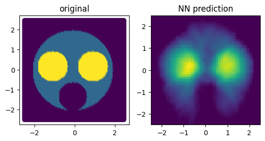
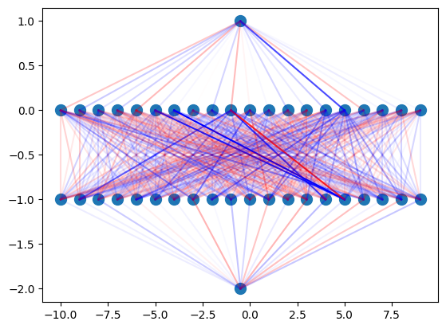
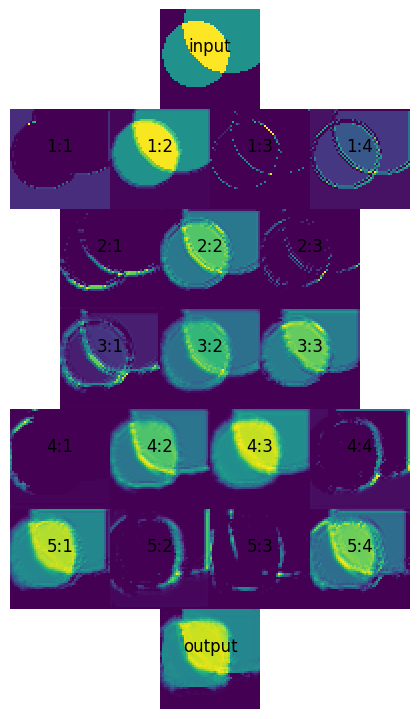
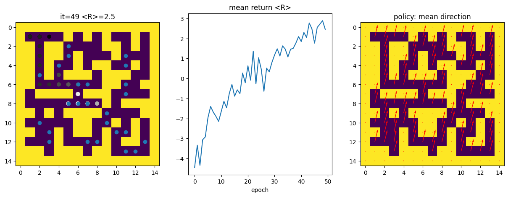

# Excersises in Machine Learning and Neural Networks

This is a selection of projects, which I wrote for the course [Machine Learning for Physicist](https://pad.gwdg.de/s/Machine_Learning_For_Physicists_2021) by Florian Marquardt from FAU (btw: great learning materials and [lectures on YT](https://www.youtube.com/watch?v=qMp3s7D_8Xw&list=PLemsnf33Vij4eFWwtoQCrt9AHjLe3uo9_)!) The course makes heavy use of `NumPy` (especially fast array operations for parallel data processing and random number generation) and `matplotlib` for visualizations.  `Keras` is used for construction and teaching of Neural Networks (NN), except for the very first excersize.

 
  
  
  
  

## 1. Backpropagation and ADAM
  This is the implementation of NN and its teaching 'by hand', using NumPy's fast array operations. An image is probed randomly to generate teaching data. After enough teaching, NN can recreate the image on the   regular mesh of points. Main components: 
  * implementatin of backpropagation algorithm
  * implementation of stochastic gradient descent and ADAM
  * visualizations (input vs. output, dynamics of NN learning, effects of neuron knockouts)

## 2. Keras and network visualization
   Basic application of Keras and a plot visualizing connections between neurons

## 3. Hand-written digits recognition
  NN trained on MNIST dataset + visualizations
  
## 4. Convolutional NN
  Excersises in convolutional NN:
  * Autoencoder - NN reproducing its input image
  * NN transforming a random image of circles into an image of squares of the same size and positions as circles
  
## 5. Simple image recognition
  * NN distinguishing Gaussian function from Cauchy distribution, for random paramters of functions
  * NN distinguishing random circle from random square

## 6. LSTM
  * simulation of coupled osscilators to generate training data
  * LSTM prediction of particle trajectory, given its previous positions
  * NN performing countdown 

## 7. Reinforced learning
  In this code an agent is supposed to learn how to move through a maze in order to maximize the number of treasures found in the maze. A NN is used to determine the best move at the current position of the agent. NN is updated depending on the outcomes of previous runs of the agent. Main components:
  * implementation of maze generating algorithm (Wilson's loop-erasing algorithm) + dynamic visualization
  * simulation of agent moving through the maze
  * NN-based policy update
  * visualization of agent's path, return function and move policy 
    
  _The code is working, but could use more fine-tuning. There may still be some bugs affecting the results._
  
